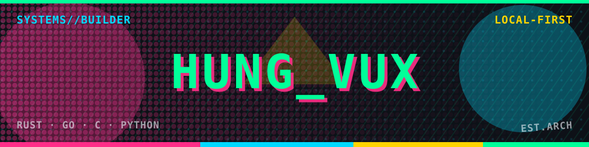
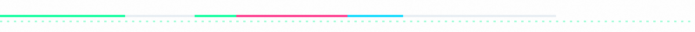
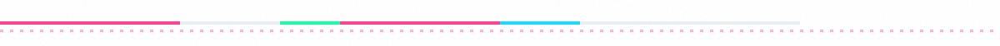
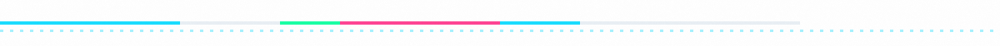
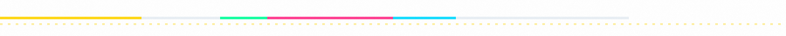
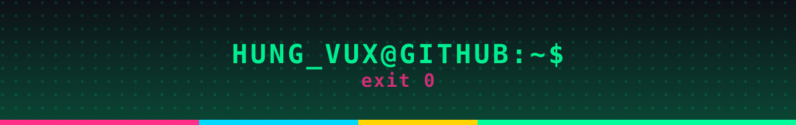

<div align="center">



**`arch linux` · `rust` · `go` · `c` · `python` · `typescript` · `dart` · `kotlin` · `c#`**

Computer science student building systems-level tools — terminal renderers, OS
hooks, CLI utilities and desktop apps, with a bias toward local-first software
where the data never has to leave the machine.

<br/>

<a href="https://archlinux.org"></a>
<a href="https://www.rust-lang.org"></a>
<a href="https://go.dev"></a>
<a href="https://github.com/ViolaPeracia?tab=repositories"></a>

</div>



## Systems &amp; Terminal

<table>
<tr>
<td width="50%" valign="top">

### <a href="https://github.com/ViolaPeracia/ZenLavaTerm">ZenLavaTerm</a>

Terminal lava lamp &amp; metaball visualizer. Scalar potential field evaluated
per frame, rasterised to ANSI and Braille cells.

`rust` · `crossterm` · `criterion`

</td>
<td width="50%" valign="top">

### <a href="https://github.com/ViolaPeracia/zenflow">zenflow</a>

HTTP/HTTPS proxy and ad blocker with a zero-allocation data path. Dynamic,
auto-refreshing blocklists.

`go`

</td>
</tr>
<tr>
<td width="50%" valign="top">

### <a href="https://github.com/ViolaPeracia/ASCII_Zen">ASCII_Zen</a>

Terminal video player rendering real-time ASCII art from decoded frames.

`go`

</td>
<td width="50%" valign="top">

### <a href="https://github.com/ViolaPeracia/fetch-win">fetch-win</a> *(fork)*

3D terminal fetch — rotating ASCII point cloud plus live system telemetry.

`c` · `win32` · `cmake`

</td>
</tr>
<tr>
<td width="50%" valign="top">

### <a href="https://github.com/ViolaPeracia/Weather-cli">Weather-cli</a>

Cross-platform weather lookup, standard library only.

`go`

</td>
<td width="50%" valign="top">

### <a href="https://github.com/ViolaPeracia/ZenRPC">ZenRPC</a>

Broadcasts the active window and its title to Discord via Rich Presence.
Windows and Linux.

`python`

</td>
</tr>
</table>



## Security &amp; Crypto

<table>
<tr>
<td width="50%" valign="top">

### <a href="https://github.com/ViolaPeracia/ZenSec">ZenSec</a>

Command-line file encryption. AES-256-GCM with Argon2id derivation, two
reviewed modules in total, no UI framework to audit.

`go` · `aes-256-gcm` · `argon2id`

</td>
<td width="50%" valign="top">

### <a href="https://github.com/ViolaPeracia/password-manager-cli">password-manager-cli</a>

Secure, lightweight CLI password store using the same primitives.

`go` · `argon2id` · `aes-256-gcm`

</td>
</tr>
</table>



## Desktop &amp; Web

<table>
<tr>
<td width="50%" valign="top">

### <a href="https://github.com/ViolaPeracia/ZenYT">ZenYT</a>

Lightweight desktop client wrapping `yt-dlp` and `ffmpeg`. Streams IPC
line-by-line, stays under 50 MB idle.

`rust` · `tauri v2` · `react 19`

</td>
<td width="50%" valign="top">

### <a href="https://github.com/ViolaPeracia/LegalLens_ZenAI">LegalLens_ZenAI</a>

Solo project built to a ten-week software-engineering plan.

`typescript`

</td>
</tr>
</table>



## Mobile &amp; Data

<table>
<tr>
<td width="50%" valign="top">

### <a href="https://github.com/ViolaPeracia/ZenFlashCard">ZenFlashCard</a>

Offline-first spaced-repetition flashcards. SM-2 scheduling engine with granular
review persistence, built to WCAG AA.

`flutter` · `dart` · `sqlite`

</td>
<td width="50%" valign="top">

### <a href="https://github.com/ViolaPeracia/AutoTyperApp">AutoTyperApp</a>

Windows auto-typer with correct Vietnamese Unicode input and keystroke-conflict
avoidance.

`c#`

</td>
</tr>
<tr>
<td width="50%" valign="top">

### <a href="https://github.com/ViolaPeracia/SocEnrMtr">SocEnrMtr</a>

Android app tracking social energy for introverts and extroverts.

`kotlin`

</td>
<td width="50%" valign="top">

</td>
</tr>
</table>

## Contributor

<table>
<tr>
<td width="50%" valign="top">

**[air-pollution-analysis](https://github.com/doctor-cato/air-pollution-analysis)**

Time-series air pollution analysis for Hanoi — INFO3020. 40 commits as
`ViolaPeracia`, the largest single contribution to the repository.

`jupyter`

</td>
<td width="50%" valign="top">

**[web-application-development](https://github.com/doctor-cato/web-application-development)**

3HD2Kcinema — cinema booking web app. Real-time seat selection, QR payment,
VIP rewards. 32 commits across two accounts.

`html` · `js`

</td>
</tr>
</table>

## Stack

| Dimension | Tools |
| :-- | :-- |
| **Languages** | `rust` · `go` · `c` · `python` · `typescript` · `dart` · `kotlin` · `c#` · `jupyter` |
| **Desktop & Mobile** | `tauri v2` · `react 19` · `flutter` · `sqlite` |
| **Terminal** | `crossterm` · `ansi` · `braille rasterization` · `tui` |
| **Crypto** | `aes-256-gcm` · `argon2id` · `x/crypto` |
| **Systems** | `arch linux` · `windows` · `win32 api` · `cmake` |
| **Automation** | `github actions` · `cron` · `svg pipelines` |

## Activity

<div align="center">


<br/>

<details>
<summary>GitHub stats</summary>


</details>

<br/>

<picture>
  <source media="(prefers-color-scheme: dark)" srcset="./profile/github-contribution-grid-snake-dark.svg" />
  <source media="(prefers-color-scheme: light)" srcset="./profile/github-contribution-grid-snake.svg" />
  
</picture>

</div>

## Principles

```text
> understand before abstracting — master the low-level mechanics first
> prefer simple architectures — minimal deps, transparent data flow
> measure before optimizing — benchmarks and profilers, not assumptions
> local-first by default — data stays on the machine unless there's a reason
> tools amplify, understanding delivers — own every abstraction
```

<div align="center">



</div>
